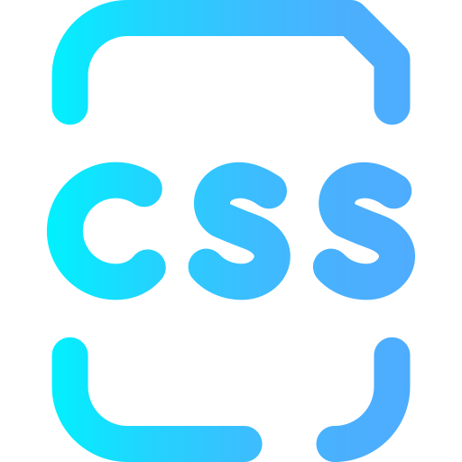
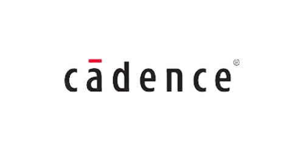
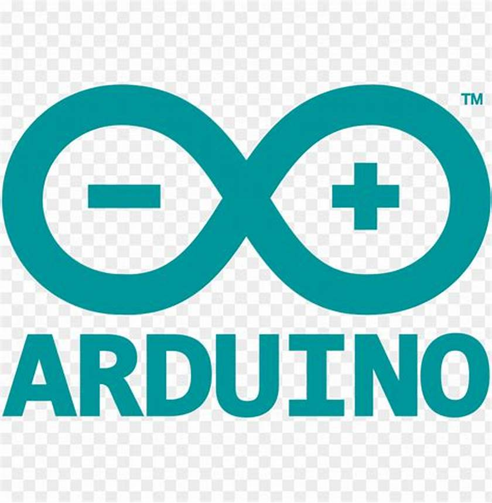
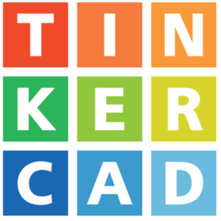
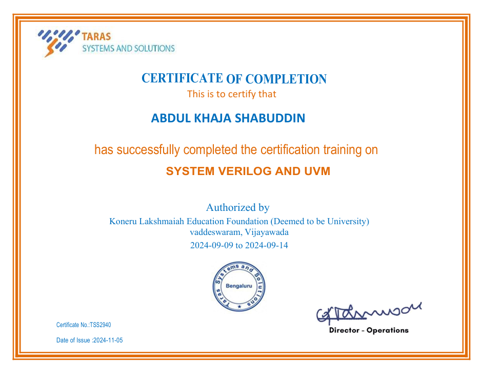
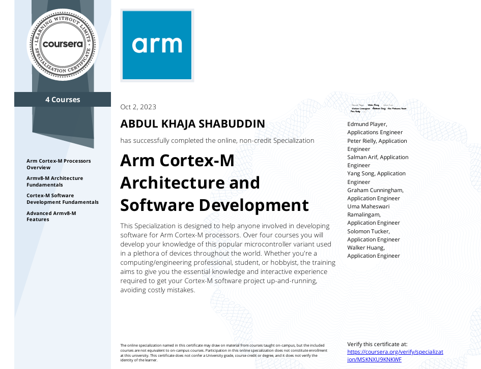
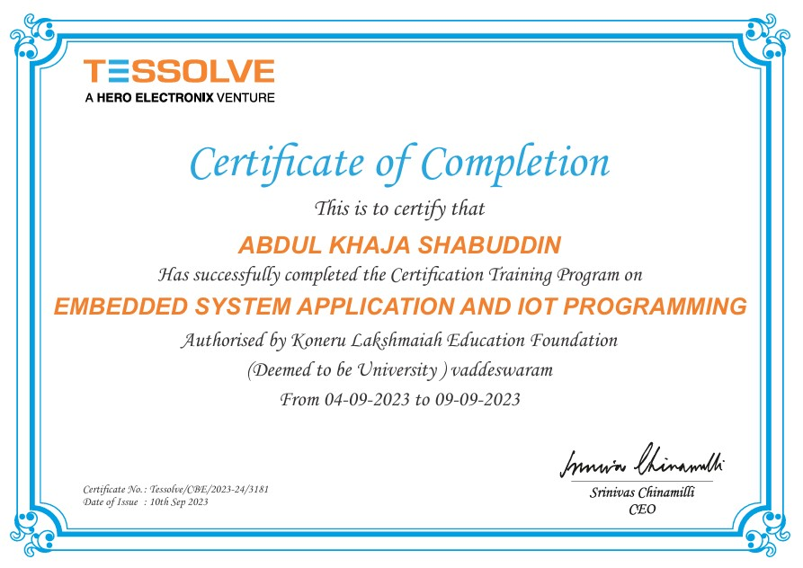

<!DOCTYPE html>
<html lang="en">
<head>
    <meta charset="UTF-8">
    <meta name="viewport" content="width=device-width, initial-scale=1.0">
    <title>MyWebsitePortfolio</title>
    <link rel="stylesheet" href="styles.css">
</head>
<body>
        

            

                <h2>🚫View Not Supported Upgrading a Mobile View</h2>
                
Please use a desktop for the best experience.

            

        

        
<header class="header-area">
    

        

            
            
        
        
        
        <nav class="navbar-main">
            <ul class="navbar-info">
                <li class="nav-item"><button class="nav-link active" onclick="loadSection('home', this)">Home</button></li>
                <li class="nav-item"><button class="nav-link" onclick="loadSection('profile', this)">Profile</button></li>
                <li class="nav-item"><button class="nav-link" onclick="loadSection('contact', this)">Contact</button></li>
            </ul>
        </nav>

        

            <button id="theme-toggle" class="theme-btn" onclick="toggleTheme()">🌙</button>
            <button class="download-btn" onclick="downloadCV()">Download  CV📥</button>
        

    

</header>

<main>
    <main>
        <section id="home" class="content-section active">
            

                

                    
                    
Vijayawada, Andhra Pradesh

                    

                    

                        <a href="https://www.linkedin.com/in/abdulkhajashabuddin16" target="_blank" class="profile-btn">LinkedIn</a>
                        <a href="https://github.com/abdulkhajashabuddin16" target="_blank" class="profile-btn">GitHub</a>
                    

                

    
                    

                        <h2>Hi 👋, I'm Abdul Khaja Shabuddin </h2>
                        
Electronics and Communication Engineering

                        
I am a full-stack developer passionate about learning new technologies and solving real-world problems.

                        
I specialize in front-end and back-end development, working with various frameworks and languages to create user-friendly applications.

                    

                

            

        </section>
    </main>

    <section id="profile" class="content-section">
        <h2>About Me</h2>
        

            
I am a full-stack developer passionate about learning new technologies and solving real-world problems.

            
I specialize in front-end and back-end development, working with various frameworks and languages to create user-friendly applications.

        

        

            <h2 class="section-title">Programming Languages and Tools</h2>
            

                

                    

                        
                        C
                    

                    

                        
                        Java
                    

                    

                        
                        HTML
                    

                    

                        
                        CSS
                    

                    

                        
                        Cadence
                    

                    

                        
                        MATLAB
                    

                    

                        
                        Arduino
                    

                    

                        
                        Tinkercad
                    

                    

                        
                        Python
                    

                    

                        
                        Verilog
                    

                    

                        
                        SQL
                    

                    

                        
                        Firebase
                    

                

            

        

        <h2>Projects</h2>
        

            

                

                    <h3>Adiabatic Logic Based Universal Shift Registers</h3>
                    
In this project, universal shift registers were designed using adiabatic logic to enhance energy efficiency compared to traditional CMOS logic. The focus is on reducing power consumption while maintaining performance.

                    <h4>Project Overview</h4>
                    
The project utilizes Cadence Virtuoso for designing and simulating the shift registers, implemented in 90nm and 45nm technologies. The comparison between CMOS and adiabatic logic is based on key performance metrics such as area, power consumption, and power-delay product (PDP).

                    <h4>Comparison Results</h4>
                    
The comparison reveals that adiabatic logic provides significant energy efficiency improvements, especially in low-power applications. The study includes detailed analysis of area, power, and PDP for both 90nm and 45nm CMOS and adiabatic designs.

                

                

                    <h3>32-Bit Comparator (SystemVerilog)</h3>
                    
This project focused on designing a 32-bit comparator and verification environment, implemented in SystemVerilog.

                    <h4>Overview</h4>
                    
The 32-bit comparator compares two 32-bit binary numbers and provides three outputs:

                    
A &gt; B : High 1 if A is greater than B.

                    
A = B : High 1 if A is equal to B.

                    
A &lt; B : High 1 if A is less than B.

                    
For more details, check out the project on <a href="https://github.com/abdulkhajashabuddin16/32bit_Comparator_SystemVerilog_Verification" target="_blank">GitHub repository</a>.

                    
For the online simulation project, you can view the code on <a href="https://www.edaplayground.com/x/uFbJ" target="_blank">EDA Playground</a>.

                

                

                    <h3>Smart Home Automation System</h3>
                    
This project involves the design and development of a smart home automation system using IoT devices. The system enables remote control and monitoring of various home appliances through a web or mobile interface.

                    <h4>Project Overview</h4>
                    
The system is built using ESP32 and NodeMCU microcontrollers, providing a reliable and flexible solution for automating home tasks such as lighting, temperature control, and security. It integrates sensors and actuators for enhanced automation capabilities.

                    <h4>System Components</h4>
                    
Components include IoT devices such as temperature and motion sensors, relay modules, and Wi-Fi communication. The ESP32 and NodeMCU control the devices and enable communication with cloud platforms for remote access.

                    

            

            

                <button class="scroll-arrow left-arrow">&#9664;</button>
                <button class="scroll-arrow right-arrow">&#9654;</button>
            
            
        

    
        <h2>Certificates</h2>
        

            

                

                    <h3>SystemVerilog & UVM Certification</h3>
                    <h4>Taras Systems and Solutions</h4>
                    
Certification in SystemVerilog & UVM, awarded by Tessolve Training Institute.

                    
                

                

                    <h3>ARM Cortex-M Processors Certification</h3>
                    <h4>Coursera</h4>
                    
Covers ARM Cortex-M processors, architecture, and programming.

                    
                    <a href="https://www.coursera.org/account/accomplishments/specialization/MSKNXU9KNKWF" target="_blank">Verify in Coursera</a>
                

                

                    <h3>Embedded Systems & IoT Programming - Level 1</h3>
                    <h4>Tessolve Training Institute</h4>
                    
Foundational course in embedded systems and IoT.

                    
                

            

            

                <button class="scroll-arrow left-arrow">&#9664;</button>
                <button class="scroll-arrow right-arrow">&#9654;</button>
            

        

        <h2>Profile Lists</h2>
        

            

                
                <button onclick="window.open('https://www.linkedin.com/in/abdulkhajashabuddin16', '_blank')">Visit</button>
            

            

                
                <button onclick="window.open('https://github.com/abdulkhajashabuddin16', '_blank')">Visit</button>
            

            

                
                <button onclick="window.open('https://www.codechef.com/users/munna_78', '_blank')">Visit</button>
            

            

                
                <button onclick="window.open('https://www.geeksforgeeks.org/user/2200040059_klu/', '_blank')">Visit</button>
            

            

                
                <button onclick="window.open('https://leetcode.com/u/2200040059_klu', '_blank')">Visit</button>
            

            

                
                <button onclick="window.open('https://www.hackerrank.com/profile/2200040059_klu', '_blank')">Visit</button>
            

            

                
                <button onclick="window.open('https://codeforces.com/profile/2200040059_klu', '_blank')">Visit</button>
            

        

    </section>       

    <section id="contact" class="content-section">
        

            <h1>Contact Me</h1>
            <ul class="contact-details">
                <li>📧 Email: your.email@example.com</li>
                <li>📞 Phone: +123 456 7890</li>
                <li>📍 Location: Your City, State, Country</li>
            </ul>
    
            <!-- Contact Form -->
            <form id="contactForm">
                <input type="text" id="name" name="name" placeholder="Your Name" required>
                <input type="email" id="email" name="email" placeholder="Your Email" required>
                <input type="text" id="location" name="location" placeholder="Location" required>
                <textarea id="message" name="message" placeholder="Your Message" required></textarea>
                <button type="submit">Send Message</button>
            </form>
        

    </section>    
    
</main>

</body>
</html>
